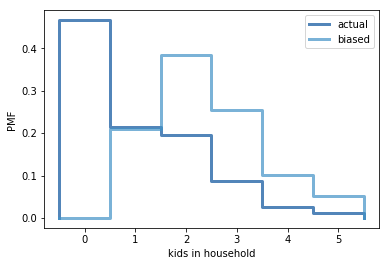

[Think Stats Chapter 3 Exercise 1](http://greenteapress.com/thinkstats2/html/thinkstats2004.html#toc31) (actual vs. biased)

**Exercise 3.1** Something like the class size paradox appears if you survey children and ask how many children are in their family. Families with many children are more likely to appear in your sample, and families with no children have no chance to be in the sample.

Use the NSFG respondent variable `numkdhh` to construct the actual distribution for the number of children under 18 in the respondents' households.

Now compute the biased distribution we would see if we surveyed the children and asked them how many children under 18 (including themselves) are in their household.

Plot the actual and biased distributions, and compute their means.


```python
import numpy as np

import nsfg
import first
import thinkstats2
import thinkplot
import probability as pr # for the BiasPmf function
```


```python
resp = nsfg.ReadFemResp()
```


```python
# print the freq. distribution of 'numkdhh' to see the numbers
print(resp['numkdhh'].value_counts().sort_index())
```

    0    3563
    1    1636
    2    1500
    3     666
    4     196
    5      82
    Name: numkdhh, dtype: int64


Note that the mode above is 0. That is, household with 0 kids have the largest frequency in the dataset.


```python
# calculate actual & biased PMFs
actual_pmf = thinkstats2.Pmf(resp['numkdhh'], label='actual')
biased_pmf = pr.BiasPmf(actual_pmf, label='biased')
```


```python
# plot both actual and biased PMFs on one chart
thinkplot.PrePlot(2)
thinkplot.Pmfs([actual_pmf, biased_pmf])
thinkplot.Show(xlabel='kids in household', ylabel='PMF')
```





    <matplotlib.figure.Figure at 0x10bc4abe0>


It makes sense that the probability of households with 0 kids is 0 if the data is collected solely by interviewing kids. 


```python
# compute the means of the 2 distributions
print('actual mean: ', actual_pmf.Mean())
print('biased mean: ', biased_pmf.Mean())
```

    actual mean:  1.024205155043831
    biased mean:  2.403679100664282

