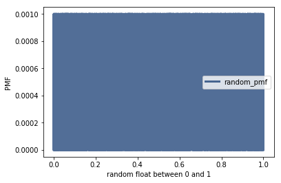
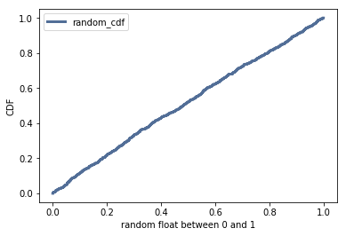

[Think Stats Chapter 4 Exercise 2](http://greenteapress.com/thinkstats2/html/thinkstats2005.html#toc41) (a random distribution)

**Exercise 4.2** The numbers generated by `numpy.random.random` are supposed to be uniform between 0 and 1; that is, every value in the range should have the same probability.

Generate 1000 numbers from `numpy.random.random` and plot their PMF.  What goes wrong?

Now plot the CDF. Is the distribution uniform?


```python
# import necessary modules
import numpy as np

import thinkstats2
import thinkplot
```


```python
# generate list of 1000 random floats
random_list = np.random.random(1000)
```


```python
# calculate and plot the PMF
random_pmf = thinkstats2.Pmf(random_list)
thinkplot.Pmf(random_pmf, label='random_pmf')
thinkplot.Config(xlabel='random float between 0 and 1', ylabel='PMF')
```





The chart above is not easy to read since the bar graphs take up all the room and are approximately the same height. Any differences between probabilities is not clear at all. Let's plot the CDF below to examine further.


```python
# calculate and plot the CDF
random_cdf = thinkstats2.Cdf(random_list)
thinkplot.Cdf(random_cdf, label='random_cdf')
thinkplot.Config(xlabel='random float between 0 and 1', ylabel='CDF')
```





The plot above of the cumulative distribution function shows that the `numpy.random.random()` function is uniformally distributed in this case.
