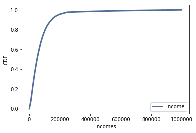
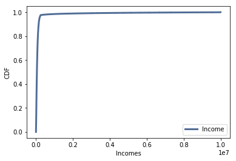

[Think Stats Chapter 6 Exercise 1](http://greenteapress.com/thinkstats2/html/thinkstats2007.html#toc60) (household income)

**Exercise 6.1** The distribution of income is famously skewed to the right. In this exercise, we’ll measure how strong that skew is.

The Current Population Survey (CPS) is a joint effort of the Bureau of Labor Statistics and the Census Bureau to study income and related variables. Data collected in 2013 is available from http://www.census.gov/hhes/www/cpstables/032013/hhinc/toc.htm. I downloaded `hinc06.xls`, which is an Excel spreadsheet with information about household income, and converted it to `hinc06.csv`, a CSV file you will find in the repository for this book. You will also find `hinc2.py`, which reads this file and transforms the data.

The dataset is in the form of a series of income ranges and the number of respondents who fell in each range. The lowest range includes respondents who reported annual household income “Under \$5000.” The highest range includes respondents who made “\$250,000 or more.”

To estimate mean and other statistics from these data, we have to make some assumptions about the lower and upper bounds, and how the values are distributed in each range. `hinc2.py` provides `InterpolateSample`, which shows one way to model this data. It takes a `DataFrame` with a column, `income`, that contains the upper bound of each range, and `freq`, which contains the number of respondents in each frame.

It also takes `log_upper`, which is an assumed upper bound on the highest range, expressed in `log10` dollars. The default value, `log_upper=6.0` represents the assumption that the largest income among the respondents is $10^6$, or one million dollars.

`InterpolateSample` generates a pseudo-sample; that is, a sample of household incomes that yields the same number of respondents in each range as the actual data. It assumes that incomes in each range are equally spaced on a `log10` scale.

Compute the median, mean, skewness and Pearson’s skewness of the resulting sample. What fraction of households reports a taxable income below the mean? How do the results depend on the assumed upper bound?


```python
# import necessary modules
import numpy as np
import hinc
import hinc2
import thinkstats2
import thinkplot
```


```python
# read income data & verify it read properly
income_df = hinc.ReadData()
income_df.head(10)
```


<div>
<style scoped>
    .dataframe tbody tr th:only-of-type {
        vertical-align: middle;
    }

    .dataframe tbody tr th {
        vertical-align: top;
    }

    .dataframe thead th {
        text-align: right;
    }
</style>
<table border="1" class="dataframe">
  <thead>
    <tr style="text-align: right;">
      <th></th>
      <th>income</th>
      <th>freq</th>
      <th>cumsum</th>
      <th>ps</th>
    </tr>
  </thead>
  <tbody>
    <tr>
      <th>0</th>
      <td>4999.0</td>
      <td>4204</td>
      <td>4204</td>
      <td>0.034330</td>
    </tr>
    <tr>
      <th>1</th>
      <td>9999.0</td>
      <td>4729</td>
      <td>8933</td>
      <td>0.072947</td>
    </tr>
    <tr>
      <th>2</th>
      <td>14999.0</td>
      <td>6982</td>
      <td>15915</td>
      <td>0.129963</td>
    </tr>
    <tr>
      <th>3</th>
      <td>19999.0</td>
      <td>7157</td>
      <td>23072</td>
      <td>0.188407</td>
    </tr>
    <tr>
      <th>4</th>
      <td>24999.0</td>
      <td>7131</td>
      <td>30203</td>
      <td>0.246640</td>
    </tr>
    <tr>
      <th>5</th>
      <td>29999.0</td>
      <td>6740</td>
      <td>36943</td>
      <td>0.301679</td>
    </tr>
    <tr>
      <th>6</th>
      <td>34999.0</td>
      <td>6354</td>
      <td>43297</td>
      <td>0.353566</td>
    </tr>
    <tr>
      <th>7</th>
      <td>39999.0</td>
      <td>5832</td>
      <td>49129</td>
      <td>0.401191</td>
    </tr>
    <tr>
      <th>8</th>
      <td>44999.0</td>
      <td>5547</td>
      <td>54676</td>
      <td>0.446488</td>
    </tr>
    <tr>
      <th>9</th>
      <td>49999.0</td>
      <td>5254</td>
      <td>59930</td>
      <td>0.489392</td>
    </tr>
  </tbody>
</table>
</div>


```python
# use 'InterpolateSample' to generate a pseudo-sample
log_sample = hinc2.InterpolateSample(income_df, log_upper=6.0)
```

    /Users/Ankur/ds/metis/metisgh/prework/ThinkStats2/code/hinc2.py:33: SettingWithCopyWarning: 
    A value is trying to be set on a copy of a slice from a DataFrame
    
    See the caveats in the documentation: http://pandas.pydata.org/pandas-docs/stable/indexing.html#indexing-view-versus-copy
      df.log_lower[0] = 3.0
    /Users/Ankur/ds/metis/metisgh/prework/ThinkStats2/code/hinc2.py:36: SettingWithCopyWarning: 
    A value is trying to be set on a copy of a slice from a DataFrame
    
    See the caveats in the documentation: http://pandas.pydata.org/pandas-docs/stable/indexing.html#indexing-view-versus-copy
      df.log_upper[41] = log_upper


```python
# Get incomes from log sample and plot CDF to examine it
incomes = np.power(10, log_sample)
incomes_cdf = thinkstats2.Cdf(incomes, label='Income')
thinkplot.Cdf(incomes_cdf)
thinkplot.Config(xlabel='Incomes',ylabel='CDF')
```





```python
# Median, mean, skewness, and Pearson's skewness
print('Median: ', np.median(incomes))
print('Mean: ', np.mean(incomes))
print('Skewness: ', thinkstats2.Skewness(incomes))
print("Pearson's skewness: ", thinkstats2.PearsonMedianSkewness(incomes))
```

    Median:  51226.9330656
    Mean:  74278.7075312
    Skewness:  4.94992024443
    Pearson's skewness:  0.736125801914


```python
# fraction of households that report a taxable income below the mean
incomes_cdf.Prob(incomes.mean())
```


    0.66000587956687196


Approximately 66% of households report an income below the mean of $74,278.71.


```python
# Increase upper bound from 10^6 to 10^7
log_sample_2 = hinc2.InterpolateSample(income_df, log_upper=7.0)
incomes_2 = np.power(10, log_sample_2)
incomes_2_cdf = thinkstats2.Cdf(incomes_2, label='Income')
thinkplot.Cdf(incomes_2_cdf)
thinkplot.Config(xlabel='Incomes',ylabel='CDF')
```

    /Users/Ankur/ds/metis/metisgh/prework/ThinkStats2/code/hinc2.py:33: SettingWithCopyWarning: 
    A value is trying to be set on a copy of a slice from a DataFrame
    
    See the caveats in the documentation: http://pandas.pydata.org/pandas-docs/stable/indexing.html#indexing-view-versus-copy
      df.log_lower[0] = 3.0
    /Users/Ankur/ds/metis/metisgh/prework/ThinkStats2/code/hinc2.py:36: SettingWithCopyWarning: 
    A value is trying to be set on a copy of a slice from a DataFrame
    
    See the caveats in the documentation: http://pandas.pydata.org/pandas-docs/stable/indexing.html#indexing-view-versus-copy
      df.log_upper[41] = log_upper





```python
# Median, mean, and other stats
print('Median: ', np.median(incomes_2))
print('Mean: ', np.mean(incomes_2))
print('Skewness: ', thinkstats2.Skewness(incomes_2))
print("Pearson's skewness: ", thinkstats2.PearsonMedianSkewness(incomes_2))
print('Percent below mean: ', incomes_2_cdf.Prob(incomes_2.mean()))
```

    Median:  51226.9330656
    Mean:  124267.397222
    Skewness:  11.6036902675
    Pearson's skewness:  0.391564509277
    Percent below mean:  0.856563066521


The results depend greatly on the assumed upper bound. Increasing it from 10<sup>6</sup> to 10<sup>7</sup> leads to greatly increasing the mean and skewness of the data.
