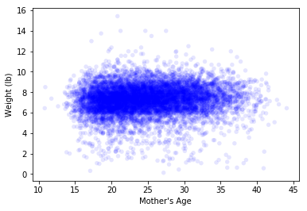
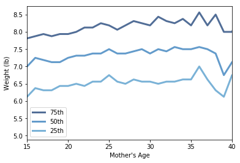

[Think Stats Chapter 7 Exercise 1](http://greenteapress.com/thinkstats2/html/thinkstats2008.html#toc70) (weight vs. age)  

**Exercise 7.1** Using data from the NSFG, make a scatter plot of birth weight versus mother’s age. Plot percentiles of birth weight versus mother’s age. Compute Pearson’s and Spearman’s correlations. How would you characterize the relationship between these variables?


```python
# import necessary modules
import first
import numpy as np
import thinkstats2
import thinkplot
```


```python
# remove rows with NaN values for mother's age or birth weight
live, firsts, others = first.MakeFrames()
live = live.dropna(subset=['agepreg', 'totalwgt_lb'])
```


```python
# create a scatter plot with transparency
thinkplot.Scatter(live.agepreg, live.totalwgt_lb, alpha=0.1)
thinkplot.Config(xlabel="Mother's Age",
                 ylabel='Weight (lb)',
                 legend=False)
```





The scatter plot above shows either a weak or zero correlation between weight and mother's age. Any relationship between the variables is not clear just yet.


```python
# create age bins and group birth weight data
age_bins = np.arange(10,45,1)
indices = np.digitize(live.agepreg, age_bins)
age_groups = live.groupby(indices)
```


```python
# compute CDF of birth weight in each group
weight_cdf = [thinkstats2.Cdf(group.totalwgt_lb) \
                     for i, group in age_groups]
```


```python
# plot percentiles
for percent in [75, 50, 25]:
    weight_percentiles = [cdf.Percentile(percent) for cdf in weight_cdf]
    label = '%dth' % percent
    thinkplot.Plot(age_bins, weight_percentiles, label=label)

thinkplot.Config(xlabel="Mother's Age",
                 ylabel='Weight (lb)',
                 xlim=[15,40],
                 legend=True)
```





Plotting the percentiles above shows a weak linear relationship while the age is less than or equal to 25, and no certain correlation for ages greater than 25. 


```python
# calculate the pearson and spearman correlations
print("Pearson's correlation: ",
      thinkstats2.Corr(live.agepreg, live.totalwgt_lb))
print("Spearman's correlation: ",
      thinkstats2.SpearmanCorr(live.agepreg, live.totalwgt_lb))
```

    Pearson's correlation:  0.0688339703541
    Spearman's correlation:  0.0946100410966


The two correlations above support the conclusion that there is a weak correlation between the two variables. Since Pearson's correlation is lower than Spearman's, we can conclude that the correlation between mother's age and birth weight is likely nonlinear.
